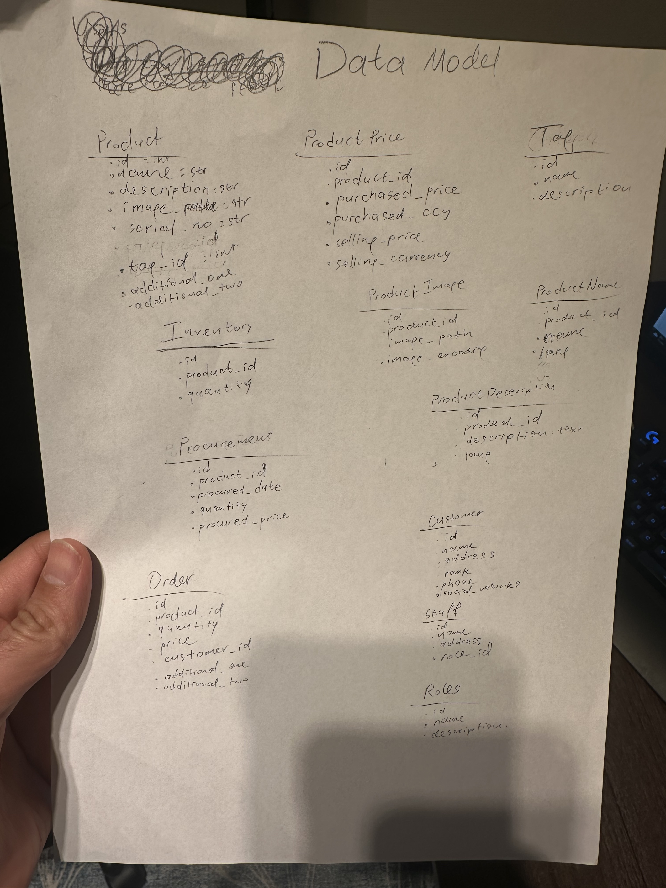

# Based on the picture that describes Data Model build Django REST application



To build a **Django REST API** based on the **data model** in the image, follow these steps:

---

### **Step 1: Install Django and Django REST Framework**
Make sure you have Django and Django REST Framework installed. If not, install them using:
```sh
pip install django djangorestframework
```

---

### **Step 2: Create Django Project and App**
Run the following commands to create a Django project and an app:
```sh
django-admin startproject inventory_system
cd inventory_system
django-admin startapp api
```

---

### **Step 3: Configure Django Settings**
In `settings.py`, add `'rest_framework'` and `'api'` to `INSTALLED_APPS`:
```python
INSTALLED_APPS = [
    'django.contrib.admin',
    'django.contrib.auth',
    'django.contrib.contenttypes',
    'django.contrib.sessions',
    'django.contrib.messages',
    'django.contrib.staticfiles',
    'rest_framework',
    'api',
]
```

---

### **Step 4: Define Models in `api/models.py`**
```python
from django.db import models

class Tag(models.Model):
    name = models.CharField(max_length=255)
    description = models.TextField(blank=True, null=True)

    def __str__(self):
        return self.name

class Product(models.Model):
    name = models.CharField(max_length=255)
    description = models.TextField()
    image = models.CharField(max_length=255, blank=True, null=True)
    serial_no = models.CharField(max_length=255, unique=True)
    tag = models.ForeignKey(Tag, on_delete=models.SET_NULL, null=True)
    additional_one = models.TextField(blank=True, null=True)
    additional_two = models.TextField(blank=True, null=True)

    def __str__(self):
        return self.name

class Inventory(models.Model):
    product = models.ForeignKey(Product, on_delete=models.CASCADE)
    quantity = models.IntegerField()

class ProductPrice(models.Model):
    product = models.ForeignKey(Product, on_delete=models.CASCADE)
    purchased_price = models.DecimalField(max_digits=10, decimal_places=2)
    purchased_currency = models.CharField(max_length=10)
    selling_price = models.DecimalField(max_digits=10, decimal_places=2)
    selling_currency = models.CharField(max_length=10)

class ProductImage(models.Model):
    product = models.ForeignKey(Product, on_delete=models.CASCADE)
    image_path = models.CharField(max_length=255)
    image_encoding = models.TextField(blank=True, null=True)

class ProductDescription(models.Model):
    product = models.ForeignKey(Product, on_delete=models.CASCADE)
    description = models.TextField()
    lang = models.CharField(max_length=5)

class ProductName(models.Model):
    product = models.ForeignKey(Product, on_delete=models.CASCADE)
    name = models.CharField(max_length=255)
    lang = models.CharField(max_length=5)

class Procurement(models.Model):
    product = models.ForeignKey(Product, on_delete=models.CASCADE)
    procured_date = models.DateField()
    quantity = models.IntegerField()
    procured_price = models.DecimalField(max_digits=10, decimal_places=2)

class Customer(models.Model):
    name = models.CharField(max_length=255)
    address = models.TextField()
    phone = models.CharField(max_length=20)
    is_bot_whatsapp = models.BooleanField(default=False)

class Staff(models.Model):
    name = models.CharField(max_length=255)
    address = models.TextField()
    role = models.ForeignKey('Role', on_delete=models.SET_NULL, null=True)

class Role(models.Model):
    name = models.CharField(max_length=255)
    description = models.TextField(blank=True, null=True)

class Order(models.Model):
    product = models.ForeignKey(Product, on_delete=models.CASCADE)
    quantity = models.IntegerField()
    price = models.DecimalField(max_digits=10, decimal_places=2)
    customer = models.ForeignKey(Customer, on_delete = models.CASCADE)
    additional_one = models.TextField(blank=True, null=True)
    additional_two = models.TextField(blank=True, null=True)
```

---

### **Step 5: Create Serializers in `api/serializers.py`**
```python
from rest_framework import serializers
from .models import *

class ProductSerializer(serializers.ModelSerializer):
    class Meta:
        model = Product
        fields = '__all__'

class InventorySerializer(serializers.ModelSerializer):
    class Meta:
        model = Inventory
        fields = '__all__'

class ProductPriceSerializer(serializers.ModelSerializer):
    class Meta:
        model = ProductPrice
        fields = '__all__'

class ProcurementSerializer(serializers.ModelSerializer):
    class Meta:
        model = Procurement
        fields = '__all__'

class OrderSerializer(serializers.ModelSerializer):
    class Meta:
        model = Order
        fields = '__all__'

class CustomerSerializer(serializers.ModelSerializer):
    class Meta:
        model = Customer
        fields = '__all__'

class StaffSerializer(serializers.ModelSerializer):
    class Meta:
        model = Staff
        fields = '__all__'

class RoleSerializer(serializers.ModelSerializer):
    class Meta:
        model = Role
        fields = '__all__'
```

---

### **Step 6: Create Views in `api/views.py`**
```python
from rest_framework import viewsets
from .models import *
from .serializers import *

class ProductViewSet(viewsets.ModelViewSet):
    queryset = Product.objects.all()
    serializer_class = ProductSerializer

class InventoryViewSet(viewsets.ModelViewSet):
    queryset = Inventory.objects.all()
    serializer_class = InventorySerializer

class ProductPriceViewSet(viewsets.ModelViewSet):
    queryset = ProductPrice.objects.all()
    serializer_class = ProductPriceSerializer

class ProcurementViewSet(viewsets.ModelViewSet):
    queryset = Procurement.objects.all()
    serializer_class = ProcurementSerializer

class OrderViewSet(viewsets.ModelViewSet):
    queryset = Order.objects.all()
    serializer_class = OrderSerializer

class CustomerViewSet(viewsets.ModelViewSet):
    queryset = Customer.objects.all()
    serializer_class = CustomerSerializer

class StaffViewSet(viewsets.ModelViewSet):
    queryset = Staff.objects.all()
    serializer_class = StaffSerializer

class RoleViewSet(viewsets.ModelViewSet):
    queryset = Role.objects.all()
    serializer_class = RoleSerializer
```

---

### **Step 7: Configure URLs in `api/urls.py`**
```python
from django.urls import path, include
from rest_framework.routers import DefaultRouter
from .views import *

router = DefaultRouter()
router.register(r'products', ProductViewSet)
router.register(r'inventory', InventoryViewSet)
router.register(r'product-prices', ProductPriceViewSet)
router.register(r'procurement', ProcurementViewSet)
router.register(r'orders', OrderViewSet)
router.register(r'customers', CustomerViewSet)
router.register(r'staff', StaffViewSet)
router.register(r'roles', RoleViewSet)

urlpatterns = [
    path('', include(router.urls)),
]
```

---

### **Step 8: Register App URLs in `inventory_system/urls.py`**
```python
from django.contrib import admin
from django.urls import path, include

urlpatterns = [
    path('admin/', admin.site.urls),
    path('api/', include('api.urls')),
]
```

---

### **Step 9: Apply Migrations and Run Server**
```sh
python manage.py makemigrations api
python manage.py migrate
python manage.py createsuperuser  # Create admin user
python manage.py runserver
```

---

### **Step 10: Test API**
Visit:
- **Django Admin**: `http://127.0.0.1:8000/admin`
- **API Endpoints**: `http://127.0.0.1:8000/api/products/`

You can use **Postman** or **Django REST Framework’s Browsable API** to test CRUD operations.

---

### **Conclusion**
This Django REST API implementation follows the data model in the image. The API allows managing products, inventory, orders, procurement, staff, roles, and more.

Let me know if you need further improvements!